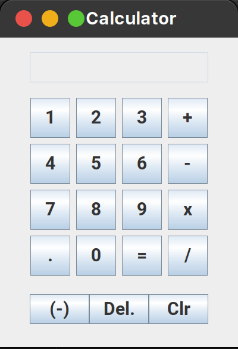

# Java Calculator 🧮️

Hi 👋 Jiro Jasmin here.  
This project is a simple calculator made with Java.
 
It can handle all four basic operations between two (positive or negative) numbers, with some "delete" (remove one character) and "clear (remove all characters) features.
 
I am currently trying to expand my skills by learning new languages.

---  
  

---

## 📰 About this project  
  
I am open for any reviews or thoughts, so please do not hesitate to tell me.

[Click here](https://github.com/jiro-jasmin?tab=repositories) to access to all my online repositories.  
Thank you for visiting my profile!  

If you would like to reach me, please contact me on my [LinkedIn profile here](https://www.linkedin.com/in/jiro-jasmin).
